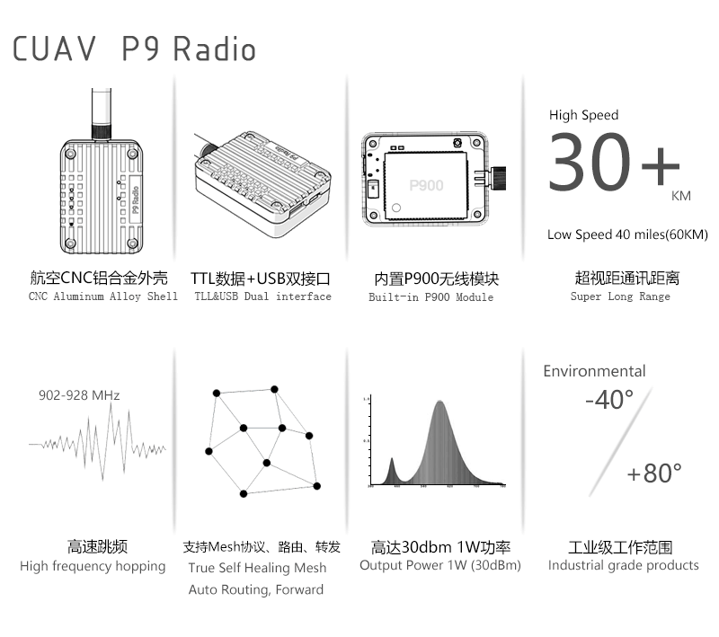
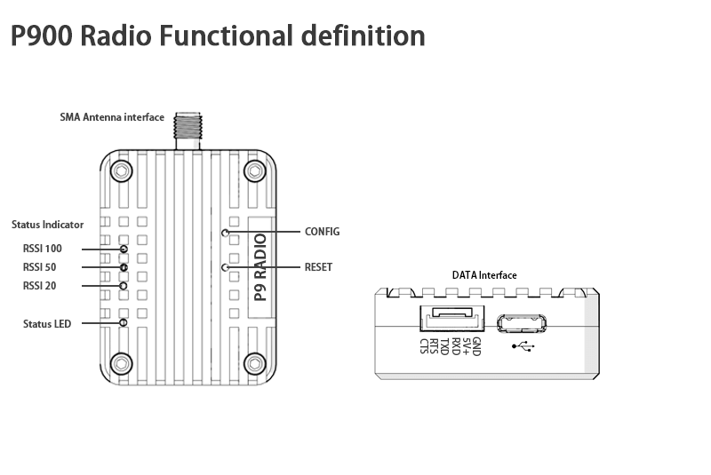

#CUAV P9 Radio

---

### Summary:

P9 Radio is a new line-of-sight drone data link communication module from CUAV. It features high power, high speed, and high receiver sensitivity, making it ideal for use in drone communications systems.

### Features:

### Technical Specifications:

| working frequency | 902-928 MHz |
| :--- | :--- |
|Transmission technology | frequency hopping  |
| Forwarding error detection| Hamming /BCH/Golay/Reed-Solomon |
| error detecting | Error Detection 32 bits of CRC, ARQ |
| encrypt | Optional \(see –AES option\) |
| range| 40 mile ( s ) \(60 km\) |
|  |  |
| sensitivity | -110 dBm @ 115.2 kbps |
|  | -108 dBm @ 172.8 kbps |
|  | -107 dBm @ 230.4 kbps |
| output power| 100mW - 1W \(20-30dBm\) |
|  serial interface | 3.3V CMOS TTL |
| Baud rate | 57600（Changeable） |
| Airspeed | 115 - 276 kbps |
|  |  |
| operator schema| Mesh, Auto Routing, Store and Forward,Self Healing, Packet Routing Modes |
|  |  |
| Blocking | +/- 1 MHz &gt; 55 dBc |
|  | +/- 2.5 MHz &gt; 60 dBc |
|  | +/- 5 MHz &gt; 65 dBc |
|  | &gt; 930 MHz &gt; 70 dBc |
|  | &lt; 890 MHz &gt; 70 dBc |
|  |  |
| Remote Diagnostics | Battery Voltage, Temperature, RSSI,Packet Statistics |
|  service voltage | 5.0V + -0.25V |
| Interface current| Sleep &lt; 1mA |
|  | Idle 3.5mA |
|  | Rx: 35mA to 80mA |
|  | Tx : 800mA to 1200mA |
| Connectors: |  |
| Antenna interface| SMA |
| interface | GH1.25-6P&USB |
| Environmental | -55o C - +85o C |
|  |  |
| Weight | 51.2MM\*38.2MM\*15.5MM |
|  |  |
| Order Option s |  |
| -AES | 128-bit AES Encryption \(requires permit for export outside of Canada and USA.\) |
| -ENC | Enclosed Model |
|  |  |

### Interface definition ：

